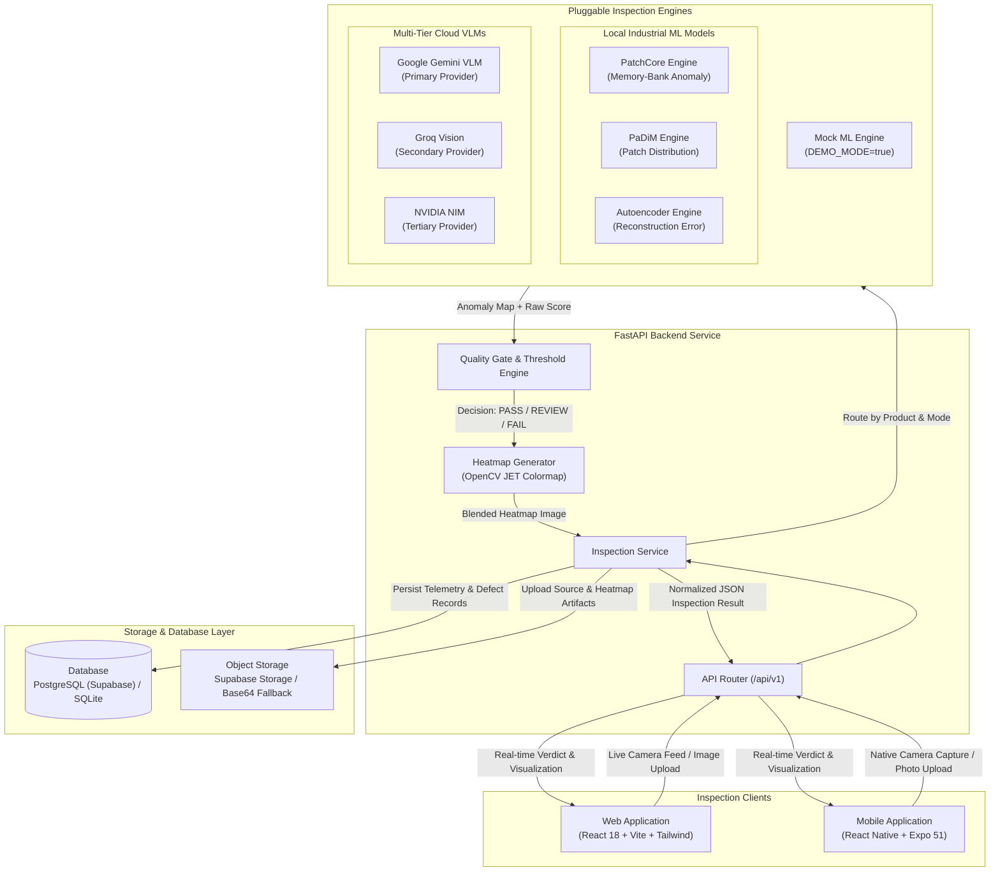

# VisionQC

> **Industrial-Grade Automated Visual Quality Inspection & Few-Shot Anomaly Detection Platform**

VisionQC is a full-stack, enterprise-structured visual quality inspection platform engineered for modern manufacturing lines, CNC machining, PCB electronics assembly, and industrial quality assurance.

In high-throughput manufacturing, traditional quality control relies heavily on manual human inspection—a process that is fatigue-prone, subjective, costly, and inherently unscalable. Meanwhile, conventional supervised computer vision models fail in industrial settings because defective samples are rare, unpredictable, and expensive to curate; a factory cannot afford to produce thousands of defective components just to train a classifier.

VisionQC solves this problem through an automated **few-shot / one-class anomaly detection architecture** combined with a **multi-tier Vision-Language Model (VLM) reasoning engine**. By learning the structural manifold of acceptable components using solely normal product images, VisionQC flags structural anomalies, micro-cracks, surface blemishes, solder bridges, and assembly flaws in real time—delivering instant **PASS / REVIEW / FAIL** decisions, calibrated anomaly scores, and pixel-precise interactive **anomaly heatmap visualizations** to plant operators on both web and mobile devices.

---

## 📑 Table of Contents

- [Project Overview](#-project-overview)
- [Why VisionQC?](#-why-visionqc)
- [Key Features](#-key-features)
- [Architecture & Workflow](#-architecture--workflow)
- [Technology Stack](#-technology-stack)
- [Repository Structure](#-repository-structure)
- [Setup & Installation Instructions](#-setup--installation-instructions)
- [Datasets & API Information](#-datasets--api-information)
- [Screenshots & Demo Information](#-screenshots--demo-information)
- [Limitations & Future Scope](#-limitations--future-scope)
- [Team Members](#-team-members)
- [Acknowledgements](#-acknowledgements)

---

## 🔍 Project Overview

VisionQC is engineered as a unified, dual-engine inspection system designed to bridge deep computer vision research and factory-floor usability.

```
[ Industrial Part ] ──▶ [ Webcam / Mobile Camera / Upload ]
                                  │
                                  ▼
                     [ FastAPI Inspection Router ]
                                  │
          ┌───────────────────────┴───────────────────────┐
          ▼                                               ▼
[ Pluggable ML Engine ]                        [ Multi-Tier VLM Provider ]
• PatchCore Memory Bank                        • Google Gemini (Primary)
• PaDiM Gaussian Embeddings                    • Groq Vision (Secondary)
• Reconstruction Autoencoders                  • NVIDIA NIM (Tertiary)
          │                                               │
          └───────────────────────┬───────────────────────┘
                                  ▼
                [ Quality Gate & Threshold Engine ]
                 • Display Anomaly Score (0.0 - 1.0)
                 • Decision: PASS / REVIEW / FAIL
                 • OpenCV Jet Heatmap Overlay
                                  │
                                  ▼
               [ Storage, Telemetry & Client Feedback ]
                 • Historical Database Logging
                 • Desktop Web Dashboard
                 • On-the-Line Mobile App
```

### Complete End-to-End Workflow:
1. **Acquisition & SKU Selection**: A quality assurance operator selects the target product profile (e.g., SMT PCB board, bearing sleeve, sheet metal bracket, or bottle) and captures an image via a connected industrial USB camera, desktop webcam, or mobile camera.
2. **Inspection Ingestion**: The high-resolution image is transmitted to the FastAPI backend via `POST /api/v1/inspections` with client origin metadata and product SKU identifiers.
3. **Pluggable Engine Execution**:
   - **Local ML Profiles**: The image is preprocessed and passed to category-specific visual anomaly models (PatchCore, PaDiM, or Autoencoders). The engine computes patch-level nearest-neighbor anomaly distances to produce a dense 2D anomaly map and scalar score without requiring prior defect examples.
   - **VLM Semantic Inspection**: In cloud/hybrid inspection modes, the image is analyzed by multi-tier vision-language models (Google Gemini, Groq, or NVIDIA NIM) using industrial inspection rubrics to classify defect types, extract severity, and localize defects.
   - **Zero-Key Mock Mode**: An optional synthetic demonstration engine (`DEMO_MODE=true`) allows complete UI, telemetry, and workflow testing without requiring GPU accelerators or external cloud keys.
4. **Quality Gate Decisioning**: The calculated anomaly score is calibrated against the product's specific threshold and review tolerance margin:
   - **PASS**: Anomaly score is comfortably below threshold.
   - **REVIEW**: Anomaly score falls within the borderline margin, alerting the operator for manual secondary verification.
   - **FAIL**: Anomaly score exceeds allowable tolerance, automatically flagging the unit as defective.
5. **Heatmap & Defect Localization**: Dense anomaly matrices are normalized and converted into high-contrast OpenCV JET colormap overlays (60% original part, 40% anomaly heat). Bounding coordinates highlight specific defect regions.
6. **Telemetry & Audit Logging**: Results, processing latency, timestamps, source images, and generated heatmaps are persisted in PostgreSQL/SQLite and Supabase object storage.
7. **Actionable Operator Feedback**: Real-time results populate the desktop Web Dashboard (with interactive opacity slider and side-by-side original/heatmap comparison) and the mobile operator app.

---

## 💡 Why VisionQC?

| Challenge in Traditional QC | VisionQC Solution |
| :--- | :--- |
| **Defective Training Data Scarcity** | Few-shot & normal-only learning: trains models strictly on good parts using PatchCore and PaDiM. |
| **Rigid, Monolithic Architectures** | Pluggable ML Adapter design: switch between deep ML models, cloud VLMs, or offline profiles with zero frontend refactoring. |
| **Black-Box AI Decisions** | Pixel-accurate visual heatmaps showing operators *exactly* why and where an anomaly was flagged. |
| **Fragmented Factory Tooling** | Dual-client accessibility: responsive Web control room dashboard for quality engineers plus an Expo mobile app for line operators. |
| **Vendor Cloud Lock-in** | Multi-tier failover across local CPU/GPU ML inference, Google Gemini, Groq, and NVIDIA NIM with local SQLite/Supabase storage. |

---

## ⚡ Key Features

- **Automated Visual Quality Inspection**: Real-time image-based defect detection for industrial assembly, manufacturing lines, and packaging.
- **Pluggable Multi-Engine Architecture**: Seamless routing between category-specific anomaly detection models, multi-tier cloud VLMs, and synthetic demonstration engines via a standardized adapter contract.
- **Calibrated Anomaly Scoring & Tri-State Decisions**: Clear `PASS`, `REVIEW`, and `FAIL` verdicts based on fine-tuned per-product thresholds and safety margins.
- **Interactive Heatmap Overlays**: OpenCV-generated JET colormap anomaly heatmaps with an interactive opacity slider allowing operators to inspect raw images, anomaly maps, and blended overlays.
- **Multi-SKU Product Management**: Catalog management for adding, updating, and calibrating inspection thresholds and golden references across distinct manufacturing SKUs.
- **Historical Telemetry & Audit Trail**: Comprehensive inspection logs with search, status filtering, latency tracking, defect breakdowns, and CSV export capabilities.
- **Executive Quality Analytics**: Visual charts powered by Recharts tracking factory yield rates, defect distribution by severity, anomaly score histograms, and inspection latency benchmarks.
- **Model Comparison Suite**: Side-by-side benchmark evaluation comparing accuracy, F1/F2 scores, precision, recall, AUROC, and False Accept / False Reject rates across PatchCore, PaDiM, and Autoencoders.
- **Responsive Desktop Web Application**: Built with React 18, Vite, TypeScript, Tailwind CSS, Radix UI primitives, and React Webcam for live station capture.
- **Operator Mobile Application**: Built with React Native and Expo 51, featuring native camera capture, gallery selection, haptic feedback, and offline-resilient inspection flows.
- **High-Performance FastAPI Backend**: Asynchronous Python backend utilizing SQLAlchemy 2.0, Pydantic v2 validation, Alembic migrations, and modular API routing.

---

## 🏛️ Architecture & Workflow

### System Architecture Diagram



### Detailed Workflow Step-by-Step

1. **Client Acquisition**: Operators access the system via the Web interface or Expo mobile app. The operator selects an active SKU and triggers a snapshot from the live camera feed or uploads an existing part image.
2. **REST Ingestion**: The image is posted as a multipart payload to `/api/v1/inspections`. The backend validates payload dimensions, file format, and size (up to 15 MB).
3. **Engine Routing**:
   - Under `model_only` or `model_primary`: The product's attached model profile is resolved. The image is passed through the anomaly detection model to extract patch features and calculate nearest-neighbor distances against the trained coreset memory bank.
   - Under `vlm_primary` or `vlm_only`: The image is dispatched with a structured inspection prompt to Google Gemini (with automatic failover to Groq or NVIDIA NIM) to identify surface defects, classifications, and qualitative explanations.
   - Under `parallel_first_valid`: Both engines execute concurrently, returning the fastest validated result.
4. **Threshold Evaluation**: The quality gate compares the normalized anomaly score $s \in [0.0, 1.0]$ against calibrated product threshold $t$ and review margin $m$:
   $$\text{Decision} = \begin{cases} \text{PASS} & s \le t - m \\ \text{REVIEW} & t - m < s \le t + m \\ \text{FAIL} & s > t + m \end{cases}$$
5. **Heatmap Synthesis**: When anomaly maps are produced, OpenCV resizes the map to match the input resolution, applies a 256-color JET colormap, and blends it with the original grayscale/RGB image.
6. **Persistence & Telemetry**: An inspection record is generated with a unique UUID, linking runtime latency, defect bounding boxes, confidence scores, and storage URLs in PostgreSQL or SQLite.
7. **Client Rendering**: The client immediately receives the inspection payload, updating the live view, defect tally, and telemetry graphs.

---

## 💻 Technology Stack

| Domain | Technology / Library | Version | Purpose in VisionQC |
| :--- | :--- | :--- | :--- |
| **Frontend / Web** | React | `^18.3.1` | Component-based UI for quality control operations |
| | Vite | `^5.3.4` | High-speed frontend build tool and dev server |
| | TypeScript | `^5.4.5` | Type-safe API contracts and frontend models |
| | Tailwind CSS | `^3.4.6` | Modern, responsive industrial interface styling |
| | Radix UI | Latest | Accessible modal dialogs, dropdowns, sliders, and tabs |
| | Recharts | `^2.15.4` | Factory yield trends, defect severity, and latency charts |
| | React Webcam | `^7.2.0` | Live inspection camera capture from workstation webcams |
| | Framer Motion | `^14.0.0` | Fluid state transitions and heatmap viewer animations |
| | Axios | `^1.7.2` | HTTP client for asynchronous backend communication |
| **Mobile** | React Native | `0.74.5` | Native mobile cross-platform runtime |
| | Expo | `~51.0.0` | Mobile framework with Expo Router 3.5 file-based routing |
| | NativeWind | `^4.2.7` | Tailwind CSS integration for React Native |
| | Expo Camera | `~15.0.0` | Hardware camera capture for mobile line inspection |
| | Expo Image Picker | `~15.0.0` | Photo gallery upload support on mobile devices |
| | Expo Haptics | `~13.0.1` | Tactile feedback for PASS/FAIL inspection triggers |
| | React Native Paper | `^5.15.3` | Mobile-optimized Material UI component library |
| **Backend** | FastAPI | `0.111.0` | High-performance asynchronous REST API framework |
| | Uvicorn | `0.30.1` | ASGI server for production asynchronous execution |
| | Pydantic | `2.7.4` | Data validation and schema enforcement (Pydantic v2) |
| | Pydantic Settings | `2.3.4` | Centralized environment variable management |
| | SQLAlchemy | `2.0.30` | Async ORM supporting PostgreSQL and SQLite |
| | Asyncpg | `0.29.0` | High-throughput asynchronous PostgreSQL client driver |
| | Aiosqlite | `^0.20.0` | Zero-configuration asynchronous local SQLite engine |
| | Alembic | `1.13.1` | Database migration management |
| **AI / ML & Vision** | PyTorch | `2.14.1` | Deep learning runtime for tensor computations |
| | Torchvision | `0.29.1` | Computer vision backbones and image transformations |
| | Anomalib | `2.3.0` | Anomaly detection framework (PatchCore, PaDiM) |
| | OpenCV Headless | `4.9.0.80` | Image processing, colormap synthesis, and heatmap blending |
| | Scikit-Learn | `1.9.1` | Anomaly score metrics, thresholding, and ROC evaluations |
| | Pillow (PIL) | `10.3.0` | Image encoding, decoding, and format conversion |
| | Ultralytics YOLO | `8.3.228` | Optional region-of-interest (ROI) bounding and segmentation |
| **Cloud & VLMs** | Google Gemini API | `0.7.2` | Primary multi-modal Vision-Language Model (`gemini-1.5-flash`) |
| | Groq API | `0.9.0` | Secondary ultra-low latency VLM (`llama-3.2-11b-vision`) |
| | NVIDIA NIM | Direct API | Tertiary enterprise VLM (`llama-3.2-11b-vision-instruct`) |
| | Supabase | `2.5.0` | Managed PostgreSQL database and object storage bucket |
| **Testing & Quality**| Pytest | `8.2.2` | Backend test suite covering APIs, models, and adapters |
| | Pytest-Asyncio | `0.23.7` | Asynchronous test execution runner |

---

## 📁 Repository Structure

```text
visionqc/
├── backend/                       # FastAPI Python Backend
│   ├── app/
│   │   ├── api/v1/                # Modular REST endpoints
│   │   │   ├── health.py          # Service health and connectivity checks
│   │   │   ├── products.py        # SKU management and profile binding
│   │   │   ├── inspections.py     # Live inspection ingestion and results
│   │   │   ├── analytics.py       # Aggregated quality telemetry and KPIs
│   │   │   ├── experiments.py     # ML benchmark metrics and comparison data
│   │   │   └── system.py          # Runtime mode switches and engine settings
│   │   ├── core/                  # Configuration, logging, and exceptions
│   │   ├── db/                    # SQLAlchemy models, sessions, and base
│   │   ├── schemas/               # Pydantic validation contracts
│   │   └── services/              # Core business and vision logic
│   │       ├── ml/                # Pluggable ML adapters (PatchCore, PaDiM, Autoencoder)
│   │       ├── vlm/               # VLM providers (Gemini, Groq, NVIDIA)
│   │       ├── heatmap/           # OpenCV JET colormap overlay generation
│   │       ├── quality_gate/      # Threshold evaluation and decision logic
│   │       └── storage/           # Supabase Storage & local Base64 handler
│   ├── tests/                     # 45+ unit and integration test suites
│   ├── seed.py                    # Database seeder with realistic manufacturing data
│   ├── requirements.txt           # Core backend dependencies
│   ├── requirements-ml.txt        # Optional deep learning dependencies (PyTorch/Anomalib)
│   ├── requirements-roi.txt       # Optional YOLO segmentation dependencies
│   └── .env.example               # Backend environment variable template
│
├── web/                           # Desktop Quality Management Web App
│   ├── src/
│   │   ├── api/                   # Typed Axios API clients
│   │   ├── components/            # Heatmap viewer, webcam feed, stats cards, tables
│   │   ├── pages/                 # Dashboard, Inspect, Products, History, Analytics, Comparison
│   │   ├── types/                 # TypeScript data models
│   │   └── App.tsx                # Main router and layout shell
│   ├── package.json               # Web dependencies and scripts
│   └── vite.config.ts             # Vite build configuration
│
├── mobile/                        # Operator Mobile Application
│   ├── app/                       # Expo Router tab screens
│   │   ├── (tabs)/index.tsx       # Live camera inspection and capture screen
│   │   ├── (tabs)/history.tsx     # Mobile inspection history feed
│   │   ├── (tabs)/products.tsx    # Active SKU catalog view
│   │   ├── (tabs)/analytics.tsx   # Mobile quality metrics and pass rate cards
│   │   └── result/                # Mobile inspection result & heatmap view
│   ├── src/                       # Mobile API client, types, and theme
│   └── package.json               # Mobile dependencies and Expo 51 configuration
│
├── experiments/                   # Industrial Training & Evaluation Suite
│   ├── datasets.json              # Catalog of evaluated industrial datasets
│   ├── train_30shot.py            # Fair few-shot comparison benchmarking runner
│   ├── export_profiles.py         # Model checkpoint packaging and catalog builder
│   └── data_protocol.py           # Dataset split and partition management
│
└── docs/                          # Technical Documentation & References
    ├── ARCHITECTURE.md            # Detailed ML adapter & routing specifications
    ├── DEPLOYMENT.md              # Production deployment runbook
    ├── SUBMISSION.md              # Hackathon verification and benchmark records
    └── supabase_bootstrap.sql     # PostgreSQL database schema and indexes
```

---

## 🛠️ Setup & Installation Instructions

Follow these step-by-step instructions to run VisionQC locally.

### Prerequisites

- **Python**: Version `3.11` or `3.12`
- **Node.js**: Version `18.x` or `20.x` (with `npm`)
- **Git**: Installed on your system
- **Expo Go App** *(Optional)*: Installed on iOS or Android for physical device mobile testing

---

### Step 1: Clone the Repository

```bash
git clone https://github.com/your-org/visionqc.git
cd visionqc
```

---

### Step 2: Backend Setup (FastAPI)

1. **Navigate to the backend directory**:
   ```bash
   cd backend
   ```

2. **Create and activate a virtual environment**:
   - **On Windows (PowerShell)**:
     ```powershell
     py -3.11 -m venv .venv
     .\.venv\Scripts\Activate.ps1
     ```
   - **On macOS / Linux**:
     ```bash
     python3 -m venv .venv
     source .venv/bin/activate
     ```

3. **Install core backend dependencies**:
   ```bash
   pip install -r requirements.txt
   ```

4. **Install optional ML inference dependencies** *(optional, needed for local PyTorch/Anomalib inference)*:
   ```bash
   pip install -r requirements-ml.txt
   ```

5. **Configure environment variables**:
   ```bash
   cp .env.example .env
   ```
   *Edit `.env` as needed. To test immediately without external keys, set `DEMO_MODE=true`.*

   ```ini
   APP_ENV=development
   APP_HOST=0.0.0.0
   APP_PORT=8000
   FRONTEND_WEB_URL=http://localhost:5173

   # Database (leave empty for automatic local SQLite, or provide Supabase URL)
   DATABASE_URL=sqlite+aiosqlite:///./visionqc.db

   # Storage (leave empty for local Base64 fallback, or provide Supabase keys)
   SUPABASE_URL=YOUR_SUPABASE_URL
   SUPABASE_SERVICE_ROLE_KEY=YOUR_SUPABASE_KEY
   SUPABASE_STORAGE_BUCKET=visionqc

   # VLM Keys (optional if DEMO_MODE=true or using local ML models)
   GOOGLE_API_KEY=YOUR_API_KEY
   GROQ_API_KEY=YOUR_API_KEY
   NVIDIA_API_KEY=YOUR_API_KEY

   # Inspection Mode (vlm_primary | model_primary | model_only | vlm_only | parallel_first_valid)
   INSPECTION_MODE=vlm_primary
   DEMO_MODE=true
   ```

6. **Seed the database with sample products and historical data**:
   ```bash
   python seed.py
   ```

7. **Start the FastAPI backend server**:
   ```bash
   uvicorn app.main:app --reload --host 0.0.0.0 --port 8000
   ```
   - **Interactive Swagger Docs**: [http://localhost:8000/docs](http://localhost:8000/docs)
   - **Health Check Endpoint**: [http://localhost:8000/health](http://localhost:8000/health)

---

### Step 3: Web Application Setup (React + Vite)

Open a new terminal window:

1. **Navigate to the web directory**:
   ```bash
   cd visionqc/web
   ```

2. **Install frontend dependencies**:
   ```bash
   npm install
   ```

3. **Start the Vite development server**:
   ```bash
   npm run dev
   ```

4. **Access the application**:
   Open your browser and navigate to **[http://localhost:5173](http://localhost:5173)**.

---

### Step 4: Mobile Application Setup (React Native + Expo)

Open a third terminal window:

1. **Navigate to the mobile directory**:
   ```bash
   cd visionqc/mobile
   ```

2. **Install mobile dependencies**:
   ```bash
   npm install
   ```

3. **Start the Expo development server**:
   ```bash
   npx expo start
   ```

4. **Run on a device or emulator**:
   - Press `a` to launch in the Android Emulator.
   - Press `i` to launch in the iOS Simulator.
   - Scan the terminal QR code using the **Expo Go** app on your physical iOS/Android phone *(ensure your phone is on the same Wi-Fi network and update `EXPO_PUBLIC_API_URL` to your computer's local IP address)*.

---

## 📊 Datasets & API Information

### Datasets Supported & Evaluated

VisionQC's anomaly detection pipeline was evaluated against standardized industrial vision benchmarks documented in [`experiments/datasets.json`](experiments/datasets.json):

1. **MVTec Anomaly Detection (MVTec AD)**:
   - **Evaluated Categories**: `bottle`, `cable`, `capsule`, `metal_nut`, `screw`, `transistor`.
   - **Inspection Focus**: Micro-scratches, fractures, structural dents, surface contamination, bent leads, and missing components.
   - **Learning Regime**: Few-shot (30 normal images per product profile) and full-normal training without defect exposure.
2. **MVTec AD 2 & MVTec LOCO**:
   - **Evaluated Categories**: `sheet_metal`, `vial`, `wallplugs`, `can`, `screw_bag`, `splicing_connectors`, `breakfast_box`.
   - **Inspection Focus**: Logical defects (missing items, misplaced assemblies) and structural deformations.
3. **MVTec 3D-AD**:
   - **Evaluated Categories**: `cable_gland`, `dowel`, `tire`.
   - **Inspection Focus**: Surface geometry and depth anomaly fusion.
4. **D2S (Densely Segmented Supermarket)**:
   - **Role**: Domain evaluation for instance-level Region of Interest (ROI) segmentation and background masking.

### Runtime Application REST Endpoints

The FastAPI backend exposes clean, versioned REST endpoints under `/api/v1`:

| Method | Endpoint | Description |
| :--- | :--- | :--- |
| `GET` | `/health` | Core system liveness and database ping |
| `GET` | `/api/v1/health` | Detailed service health, mode status, and VLM readiness |
| `GET` | `/api/v1/products` | Retrieve all registered product SKUs, thresholds, and stats |
| `POST` | `/api/v1/products` | Register a new manufacturing product profile |
| `GET` | `/api/v1/products/{id}` | Retrieve specific product details, golden images, and attached profile |
| `POST` | `/api/v1/products/{id}/profile` | Attach an exported model profile catalog entry to a product SKU |
| `POST` | `/api/v1/inspections` | Upload multipart product image; executes inspection and returns verdict |
| `GET` | `/api/v1/inspections` | Paginated inspection history with date, SKU, and status filters |
| `GET` | `/api/v1/inspections/{id}` | Detailed inspection telemetry, raw image URL, and heatmap overlay |
| `GET` | `/api/v1/analytics/summary` | Real-time factory KPIs: total inspections, pass rate, defect breakdown |
| `GET` | `/api/v1/analytics/trends` | Time-series historical yield rates and anomaly score distributions |
| `GET` | `/api/v1/experiments/comparison`| Retrieve benchmark evaluation comparisons across PatchCore, PaDiM, Autoencoders |
| `GET` | `/api/v1/system/status` | Current active inspection mode, cache status, and hardware devices |

---

## 📸 Screenshots & Demo Information

### User Interface Visuals

### Dashboard
<!-- Add Dashboard screenshot here -->
> *Real-time factory floor overview displaying current operational yield, total inspection volume, defect severity breakdown, and live recent inspection stream.*

### Product Inspection
<!-- Add Inspection screenshot here -->
> *Live workstation inspection interface featuring camera stream capture, SKU selection, real-time trigger, and instant tri-state PASS / REVIEW / FAIL decision badge.*

### Anomaly Heatmap / Result
<!-- Add Result screenshot here -->
> *Interactive OpenCV JET anomaly heatmap viewer with opacity cross-fade slider, defect bounding boxes, confidence score gauge, and execution latency telemetry.*

### Mobile Application
<!-- Add Mobile screenshot here -->
> *Expo mobile operator interface showing camera view with haptic trigger, inspection history feed, and touch-optimized anomaly overlay inspection.*

---

### Recommended Hackathon Demo Flow

When presenting VisionQC to judges, execute the following 5-step demonstration:

1. **SKU Selection & Golden Reference**:
   - Open **[http://localhost:5173/products](http://localhost:5173/products)**.
   - Show how products (e.g., SMT PCB Board or Industrial Bottle) are configured with customizable acceptance thresholds and defect tolerance bands.
2. **Execute a Passing Inspection**:
   - Navigate to the **Inspect** tab (`/inspect`).
   - Select a standard good part and trigger inspection via webcam or image upload.
   - Observe the sub-second processing latency, low anomaly score, and green **PASS** banner.
3. **Execute a Defective Inspection with Heatmap Localization**:
   - Upload a defective part image (e.g., with a surface scratch, micro-crack, or missing component).
   - Observe the red **FAIL** badge and the generated **Anomaly Heatmap**.
   - Move the **Opacity Slider** back and forth to show judges how the heatmap precisely highlights the anomaly against the physical component.
4. **Inspect Historical Telemetry**:
   - Open the **History** tab (`/history`).
   - Demonstrate the audit trail, filter by status (`FAIL` / `REVIEW`), and inspect individual historical records.
5. **Explore Analytics & Model Comparison**:
   - Open the **Analytics** tab (`/analytics`) to show manufacturing yield trends, failure rates by category, and score distribution charts.
   - Open the **Comparison** tab (`/comparison`) to demonstrate the scientific rigor comparing PatchCore, PaDiM, and Autoencoders across industrial benchmark metrics.

---

## ⚠️ Limitations & Future Scope

### Current Limitations

- **Factory Lighting Variance**: Extreme variations in ambient light or shadows can alter surface reflections, affecting pixel-level anomaly scores without standardized lighting enclosures.
- **Hardware Downscaling on Ultra-High Resolution Feeds**: Industrial line cameras producing 4K/8K images must currently be downscaled or tiled to maintain low-latency CPU/GPU throughput.
- **Continuous Video Stream Ingestion**: The system operates on triggered still captures (webcam, camera trigger, upload) rather than a persistent 60 FPS RTSP industrial video stream.
- **Mobile Edge Acceleration**: The mobile application communicates with the backend over Wi-Fi/LAN; on-device neural acceleration (e.g., Apple Neural Engine or Android NNAPI) is not yet compiled for fully disconnected mobile inference.

### Future Scope

- **Edge TensorRT / ONNX Deployment**: Quantize and export PatchCore and PaDiM models via TensorRT INT8 to run natively at 60+ FPS on edge hardware like NVIDIA Jetson Orin.
- **Continuous Active Learning (Human-in-the-Loop)**: Allow quality managers to review borderline items and automatically incorporate verified edge cases into the normal memory bank without full model retraining.
- **Multi-Camera & 3D Sensor Fusion**: Integrate multi-view synchronized captures and photometric stereo cameras for 360-degree volumetric part inspection.
- **Industrial PLC & SCADA Integration**: Implement native industrial automation protocols (OPC-UA, Modbus, MQTT) to trigger pneumatic rejection diverters and robotic sorting arms on active conveyor belts.
- **Autonomous Defect Classification**: Expand few-shot VLM prompting with specialized domain knowledge bases to automatically assign root-cause failure codes (e.g., thermal stress vs mechanical shearing).

---

## 👥 Team Members

*Built for TECHFORGE 2026 by:*

| Member Name | Role / Focus |
| :--- | :--- |
| **Mandar Sawant** | **Team Leader** |
| **Vatsal Panchal** | Core Contributor |
| **Aashka Agrawal** | Core Contributor |
| **Krisha Jain** | Core Contributor |

---

## 🏆 Acknowledgements

- **MVTec Software GmbH** for the MVTec Anomaly Detection benchmark datasets.
- **Anomalib & PyTorch Lightning Teams** for the underlying computer vision and anomaly detection research libraries.
- **Google Cloud & Groq** for high-throughput Vision-Language Model APIs.
- **Techforge 2026 Hackathon Organizers & Judges** for the opportunity to build and present VisionQC.
